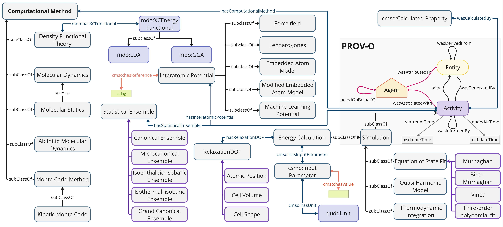

# Atomistic Simulation Methods Ontology (ASMO)

ASMO is an ontology that aims to define the concepts needed to describe commonly used atomic scale simulation methods, i.e. density functional theory, molecular dynamics, Monte Carlo methods, etc. ASMO uses the Provenance Ontology (PROV-O) to describe the simulation process.

* **Documentation**: [https://ocdo.github.io/asmo/](https://ocdo.github.io/asmo/)

### Acknowledgement
This work is developed at the Materials Data Science and Informatics (IAS‑9), Forschungszentrum Jülich GmbH. Supported by the NFDI-MatWerk consortium (Funded by the Deutsche Forschungsgemeinschaft (DFG, German Research Foundation) under the National Research Data Infrastructure – NFDI 38/1 – project number 460247524"). 
